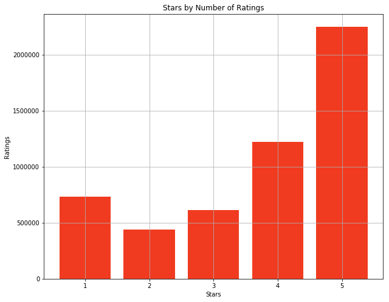
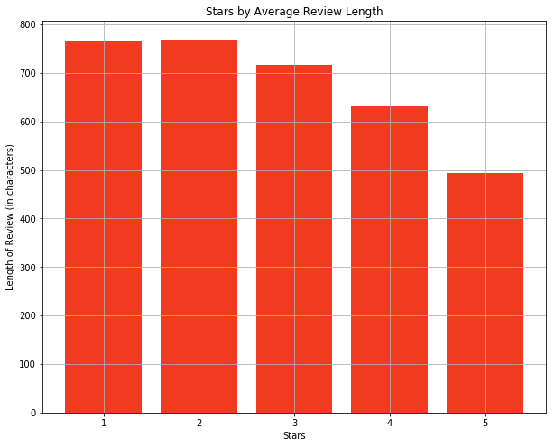
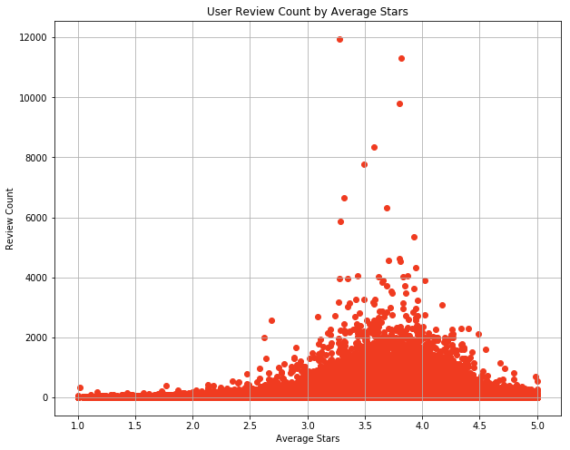
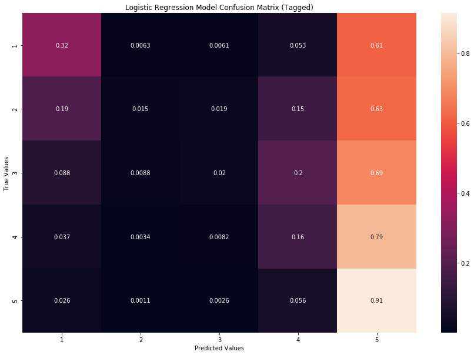
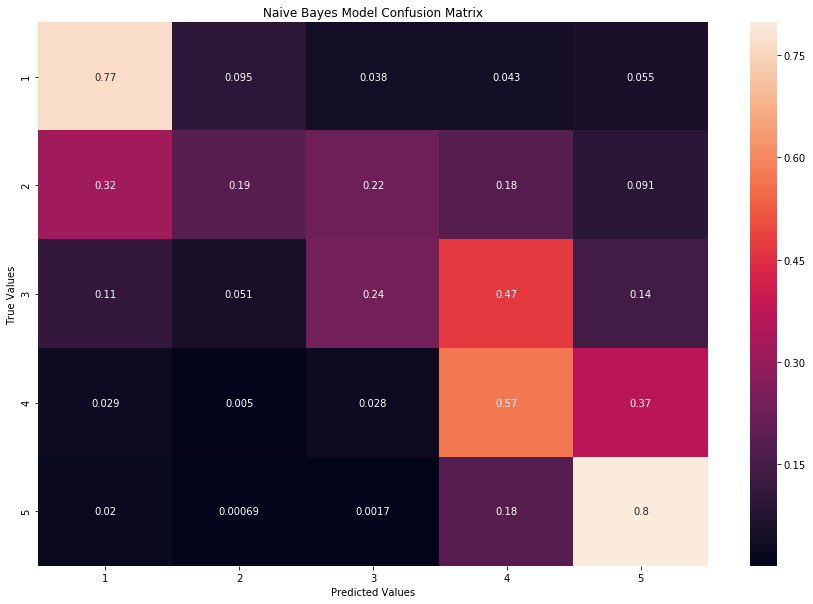
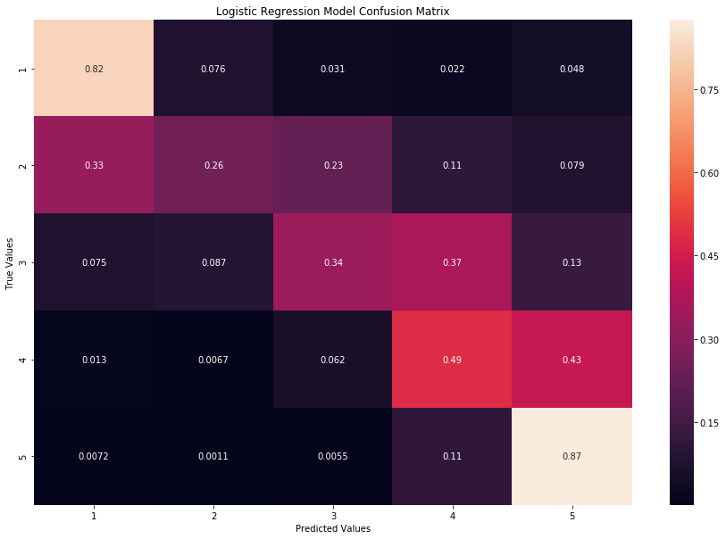
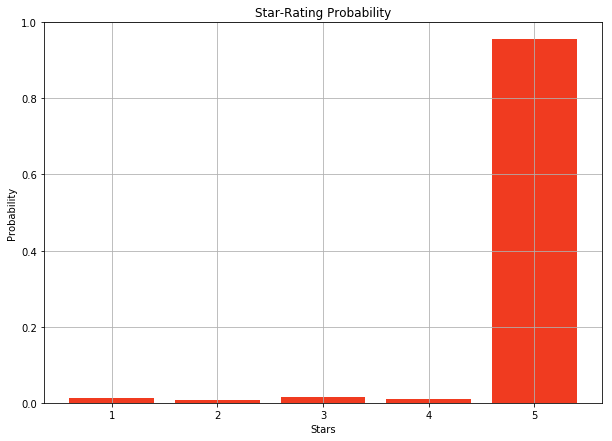
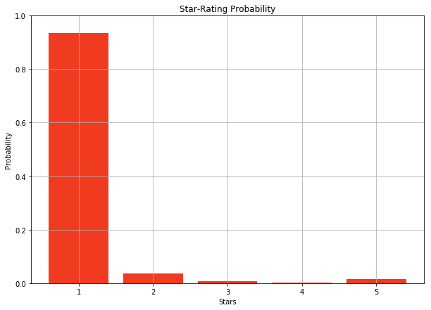
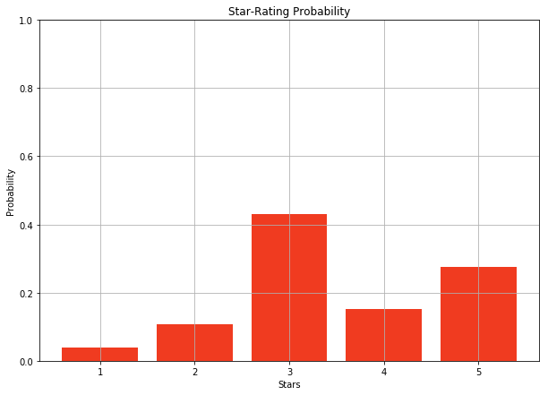

<font size="200">Yelp Reviews and NLP</font>

### Gabriel So

## Overview

- Review forum
- Restaurants and businesses
- 150 million reviews as of 2017
- 5-star ratings system
- Check-in

### Yelp Open Dataset
- Open Dataset of over 5 million reviews
- Subset of Yelp's full database
- Over 1 million users
- English language
- 17th release of this dataset

## Data at a Glance


```python
bid_stars = pd.read_sql(""" SELECT business_id, user_id, text, stars FROM review""", engine)

useful = pd.read_sql(""" SELECT useful FROM review""", engine)

from sklearn.model_selection import train_test_split
subX, bigX, suby, bigy = train_test_split(bid_stars['text'], bid_stars['stars'], train_size = 0.1)
```


```python
plt.bar(bid_stars['stars'].value_counts().index,bid_stars['stars'].value_counts(), color = '#f03b20')
plt.xlabel('Stars')
plt.ylabel('Ratings')
plt.title('Stars by Number of Ratings')
plt.grid()
plt.show();
```


    

    


```python
plt.bar(mean_len_star.index,mean_len_star['length(text)'], color = '#f03b20')
plt.xlabel('Stars')
plt.ylabel('Length of Review (in characters)')
plt.title('Stars by Average Review Length')
plt.grid()
plt.show();
```


    

    


```python
plt.scatter(users['average_stars'],users['review_count'], color = '#f03b20')
plt.xlabel('Average Stars')
plt.ylabel('Review Count')
plt.title('User Review Count by Average Stars')
plt.grid()
plt.show();
```


    

    


The most active users are around the 3.5-4 range

# Modelling the Data

### Parts of Speech Tagging

- First abstract parts of speech from reviews counting each occurrence
- Use category counts
- More generalizable across languages
- More interpretable results


```python
import nltk
```


```python
subX2 = subX.reset_index()
suby2 = suby.reset_index()

tokened = nltk.pos_tag(nltk.word_tokenize(subX2['text'][0]))

pos_count = []
for i in range(len(subX2['text'])):
    tokened = nltk.pos_tag(nltk.word_tokenize(subX2['text'][i]))
    tags = [b[1] for b in tokened]
    fd = nltk.FreqDist(tags)
    pos_count.append(dict(fd))
    if i%5000==0:
        print(f'done {i}')

tagged = pd.DataFrame(pos_count)
tagged = tagged.drop(columns=['#', '$', '\'\'', '(', ')', ',', '.', ':','``'])
tagged = tagged.fillna(0)

```


```python
tagged.head()
```


<div>
<style scoped>
    .dataframe tbody tr th:only-of-type {
        vertical-align: middle;
    }

    .dataframe tbody tr th {
        vertical-align: top;
    }

    .dataframe thead th {
        text-align: right;
    }
</style>
<table border="1" class="dataframe">
  <thead>
    <tr style="text-align: right;">
      <th></th>
      <th>CC</th>
      <th>CD</th>
      <th>DT</th>
      <th>EX</th>
      <th>FW</th>
      <th>IN</th>
      <th>JJ</th>
      <th>JJR</th>
      <th>JJS</th>
      <th>LS</th>
      <th>...</th>
      <th>VB</th>
      <th>VBD</th>
      <th>VBG</th>
      <th>VBN</th>
      <th>VBP</th>
      <th>VBZ</th>
      <th>WDT</th>
      <th>WP</th>
      <th>WP$</th>
      <th>WRB</th>
    </tr>
  </thead>
  <tbody>
    <tr>
      <th>0</th>
      <td>8.0</td>
      <td>5.0</td>
      <td>25.0</td>
      <td>0.0</td>
      <td>0.0</td>
      <td>28.0</td>
      <td>12.0</td>
      <td>0.0</td>
      <td>3.0</td>
      <td>0.0</td>
      <td>...</td>
      <td>5.0</td>
      <td>14.0</td>
      <td>6.0</td>
      <td>7.0</td>
      <td>10.0</td>
      <td>2.0</td>
      <td>0.0</td>
      <td>0.0</td>
      <td>0.0</td>
      <td>1.0</td>
    </tr>
    <tr>
      <th>1</th>
      <td>10.0</td>
      <td>1.0</td>
      <td>39.0</td>
      <td>1.0</td>
      <td>0.0</td>
      <td>45.0</td>
      <td>24.0</td>
      <td>2.0</td>
      <td>0.0</td>
      <td>0.0</td>
      <td>...</td>
      <td>6.0</td>
      <td>21.0</td>
      <td>7.0</td>
      <td>10.0</td>
      <td>7.0</td>
      <td>5.0</td>
      <td>1.0</td>
      <td>2.0</td>
      <td>0.0</td>
      <td>1.0</td>
    </tr>
    <tr>
      <th>2</th>
      <td>1.0</td>
      <td>0.0</td>
      <td>1.0</td>
      <td>0.0</td>
      <td>0.0</td>
      <td>1.0</td>
      <td>4.0</td>
      <td>0.0</td>
      <td>0.0</td>
      <td>0.0</td>
      <td>...</td>
      <td>0.0</td>
      <td>0.0</td>
      <td>0.0</td>
      <td>1.0</td>
      <td>0.0</td>
      <td>0.0</td>
      <td>0.0</td>
      <td>0.0</td>
      <td>0.0</td>
      <td>0.0</td>
    </tr>
    <tr>
      <th>3</th>
      <td>7.0</td>
      <td>2.0</td>
      <td>13.0</td>
      <td>1.0</td>
      <td>0.0</td>
      <td>10.0</td>
      <td>12.0</td>
      <td>0.0</td>
      <td>0.0</td>
      <td>0.0</td>
      <td>...</td>
      <td>7.0</td>
      <td>1.0</td>
      <td>1.0</td>
      <td>2.0</td>
      <td>5.0</td>
      <td>9.0</td>
      <td>1.0</td>
      <td>0.0</td>
      <td>0.0</td>
      <td>0.0</td>
    </tr>
    <tr>
      <th>4</th>
      <td>4.0</td>
      <td>2.0</td>
      <td>8.0</td>
      <td>0.0</td>
      <td>0.0</td>
      <td>12.0</td>
      <td>10.0</td>
      <td>2.0</td>
      <td>0.0</td>
      <td>0.0</td>
      <td>...</td>
      <td>7.0</td>
      <td>9.0</td>
      <td>2.0</td>
      <td>3.0</td>
      <td>2.0</td>
      <td>0.0</td>
      <td>0.0</td>
      <td>0.0</td>
      <td>0.0</td>
      <td>0.0</td>
    </tr>
  </tbody>
</table>
<p>5 rows × 36 columns</p>
</div>


```python
train_taggedX, test_taggedX, train_suby2, test_suby2 = train_test_split(taggedX, taggedy, train_size = 0.8)
from sklearn.linear_model import LogisticRegression
logregpos = LogisticRegression()
logregpos.fit(train_taggedX, train_suby2)
logregpos.score(test_taggedX, test_suby2)
```


    0.47645247733622215


```python
confusion = confusion_matrix(test_suby2, logregpos.predict(test_taggedX))
ax = sns.heatmap(confusion/confusion.sum(axis=1)[:, np.newaxis], 
            xticklabels=range(1,6), yticklabels=range(1,6),annot=True)
ax.set(xlabel='Predicted Values', ylabel='True Values')
ax.set_title('Logistic Regression Model Confusion Matrix (Tagged)');
```


    

    


## Bag of Words Models

- Frequency based models
- Many more features


```python
from nltk.stem.snowball import SnowballStemmer
stemmer = SnowballStemmer('english')
subX =[' '.join([stemmer.stem(word) for word in text.split(' ')])for text in subX]
train_subX, test_subX, train_suby, test_suby = train_test_split(subX, suby, train_size = 0.8)
```


```python
from sklearn.naive_bayes import GaussianNB, MultinomialNB, BernoulliNB
```


```python
tvect = TfidfVectorizer(min_df=100, stop_words="english", ngram_range=(1,3)).fit(train_subX)
```


```python
train_tvectX = tvect.transform(train_subX)
test_tvectX = tvect.transform(test_subX)
```

### Multinomial Naive Bayes Model


```python
nbmodel = MultinomialNB()
nbmodel.fit(train_tvectX, train_suby)
nbmodel.score(test_tvectX, test_suby)
```


    0.6253587243666495


```python
from sklearn.metrics import confusion_matrix
import seaborn as sns
nbconfusion = confusion_matrix(test_suby, nbmodel.predict(test_tvectX))
```


```python
ax2 = sns.heatmap(nbconfusion/nbconfusion.sum(axis=1)[:, np.newaxis], 
            xticklabels=range(1,6), yticklabels=range(1,6),annot=True)
ax2.set(xlabel='Predicted Values', ylabel='True Values')
ax2.set_title('Naive Bayes Model Confusion Matrix');
```


    

    


### Logistic Regression Model


```python
from sklearn.linear_model import LogisticRegression
logreg = LogisticRegression()
logreg.fit(train_tvectX, train_suby)
logreg.score(test_tvectX, test_suby)
```


    0.6641199612292605


```python
logreg.score(train_tvectX, train_suby)
```


    0.7126162895669609


```python
from sklearn.metrics import confusion_matrix
import seaborn as sns
confusion = confusion_matrix(test_suby, logreg.predict(test_tvectX))
```


```python
ax = sns.heatmap(confusion/confusion.sum(axis=1)[:, np.newaxis], 
            xticklabels=range(1,6), yticklabels=range(1,6),annot=True)
ax.set(xlabel='Predicted Values', ylabel='True Values')
ax.set_title('Logistic Regression Model Confusion Matrix');
```


    

    


```python
import pickle
logreg = pickle.load(open('lrmodel.sav', 'rb'))
tvect = pickle.load(open('tvect.sav', 'rb'))
```


```python
import matplotlib.pyplot as plt
import numpy as np
%matplotlib inline
plt.rcParams['figure.figsize'] = (10,7)
```

# Making Model-based Predictions


```python
from nltk.stem.snowball import SnowballStemmer
stemmer = SnowballStemmer('english')
def testme(comment):
    review = [comment]
    review =[' '.join([stemmer.stem(word) for word in text.split(' ')])for text in review]
    minitest = tvect.transform(review)
    logreg.predict_proba(minitest)
    plt.bar([1,2,3,4,5],np.ravel(logreg.predict_proba(minitest)), color = '#f03b20')
    plt.xlabel('Stars')
    plt.ylabel('Probability')
    plt.ylim(0,1)
    plt.title('Star-Rating Probability')
    plt.grid()
    plt.show()
```


```python
testme('This is the best restaurant I have ever been to.')
```


    

    


```python
testme('The service at this store is absolutely awful. I will never come here again')
```


    

    


```python
testme('The food was good, but there were too many people.')
```


    

    


# Further predictions

- Ensemble methods do not appear to work well with bag of words data.
- KNN, Decision Trees and Random Forest models all perform well below Naive Bayes models and Logistic Regression models
- Moving into neural networks, Convolutional Neural Networks are known to work well with text (and image) data.


```python

```
